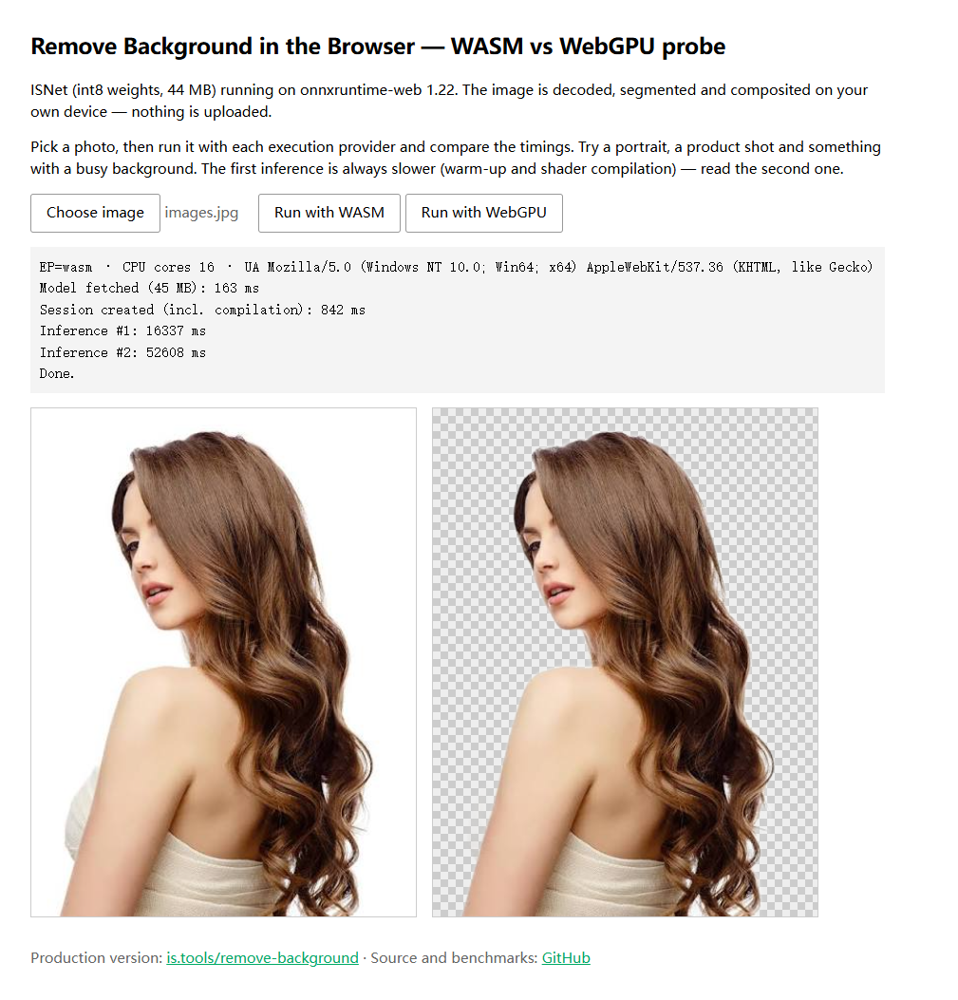
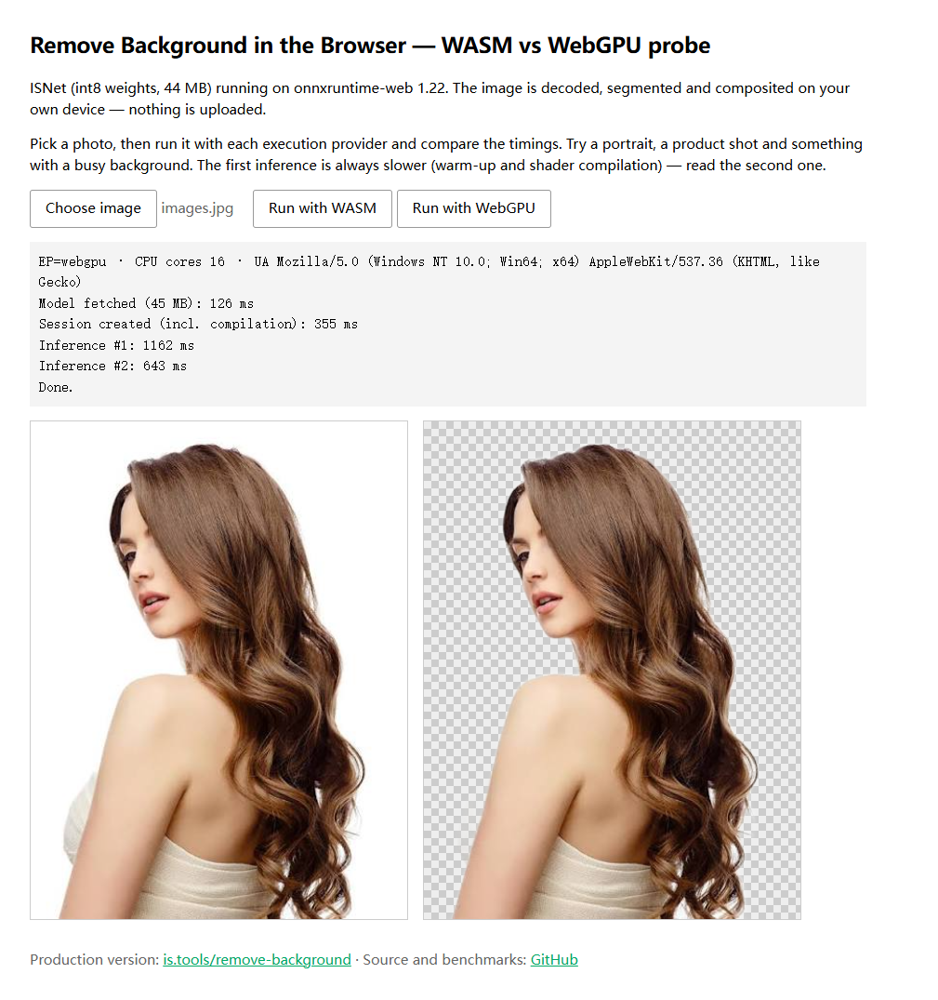

# Browser Remove Background

Removes image backgrounds **entirely in your browser** — the image is decoded,
segmented and composited on your own device. Nothing is uploaded, no server,
no API key, no account.

Built with [ONNX Runtime Web](https://onnxruntime.ai/docs/tutorials/web/) running
the ISNet segmentation model (Apache-2.0), with both WASM and WebGPU execution
providers so you can measure the difference yourself.

## Live demo

**[chenjindu.github.io/browser-remove-background](https://chenjindu.github.io/browser-remove-background/)**

A production version with a proper UI runs at
**[https://is.tools/remove-background](https://is.tools/remove-background)** — free, no
signup, no watermark, no size cap.

## Run it locally

    npx serve .

Then open http://localhost:3000, pick a photo, and run inference with WASM and
with WebGPU to compare.

## Benchmark

Measured on a desktop with a discrete GPU, Chrome 113+, 1024×1024 input:

| Execution provider | 2nd inference |
|---|---|
| WebGPU | ~0.6 s |
| WASM   | ~17 s  |

The first run is always slower — model download, session creation and shader
compilation. Read the second number.

*WASM — runs everywhere, roughly 25× slower.*

*WebGPU — Chrome/Edge 113+, sub-second after warm-up.*

## Requirements

WebGPU needs Chrome or Edge 113+. Without it the page falls back to WASM, which
works in any modern browser but is roughly 25× slower on this model.

The model ships as three parts under `model/` and is reassembled in the browser,
which keeps every file under GitHub's size limit.

## Part of is.tools

This probe came out of building [**https://is.tools**](https://is.tools) — a set of
browser-side tools for PDF, image, text and encoding work, built under one rule:
the file never leaves your device.

Same approach throughout: image codecs are MozJPEG / libwebp / libavif / OxiPNG
compiled to WASM, PDF work uses pdf-lib and qpdf, OCR uses tesseract.js, and
background removal uses the ISNet model in this repo. No accounts, no quotas, no
upload step, no watermark on the output.

Available in 8 languages.

## License

Apache-2.0. The ISNet model is Apache-2.0 as well.
